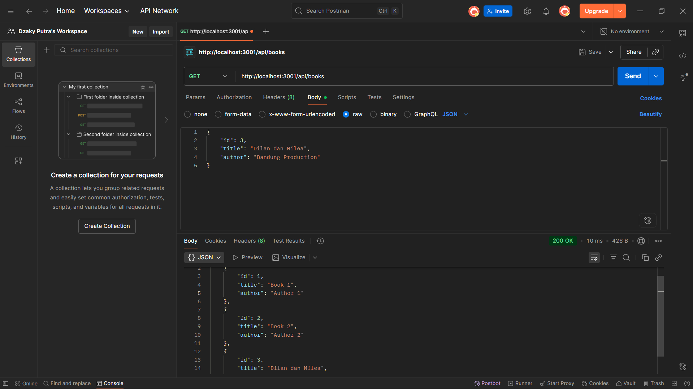
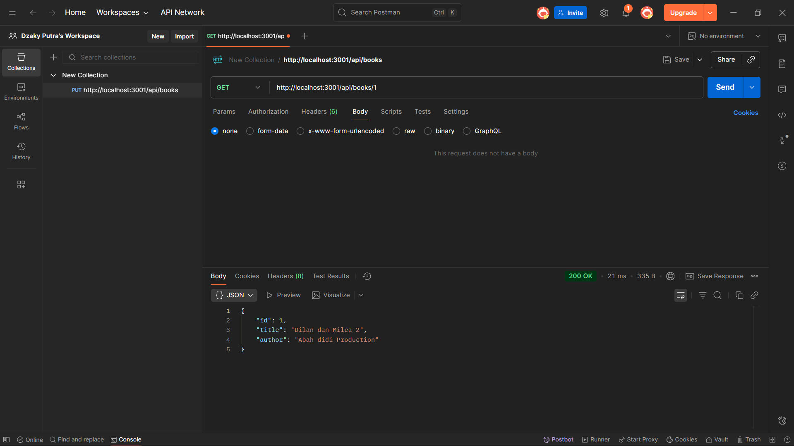
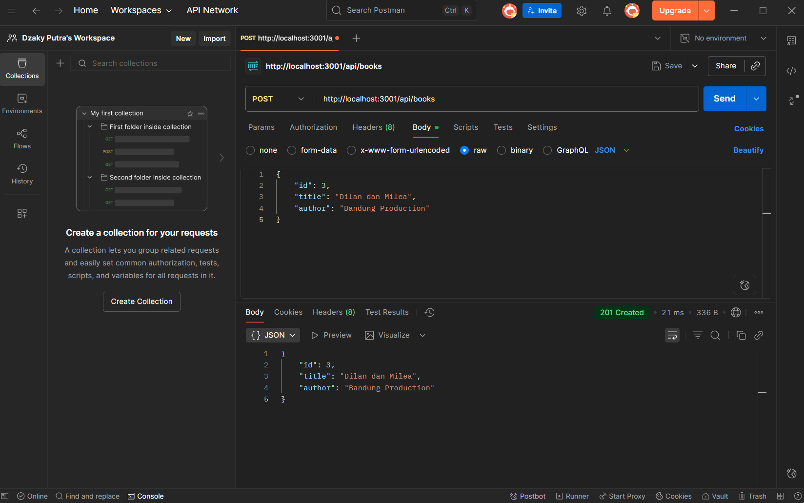

## Screenshot API Endpoint CRUD

### 1. GET – Menampilkan semua buku

### 2. GET – Menampilkan 1 buku berdasarkan ID

### 3. POST – Menambah buku baru

### 4. PUT – Mengupdate buku

### 5. DELETE – Menghapus buku

