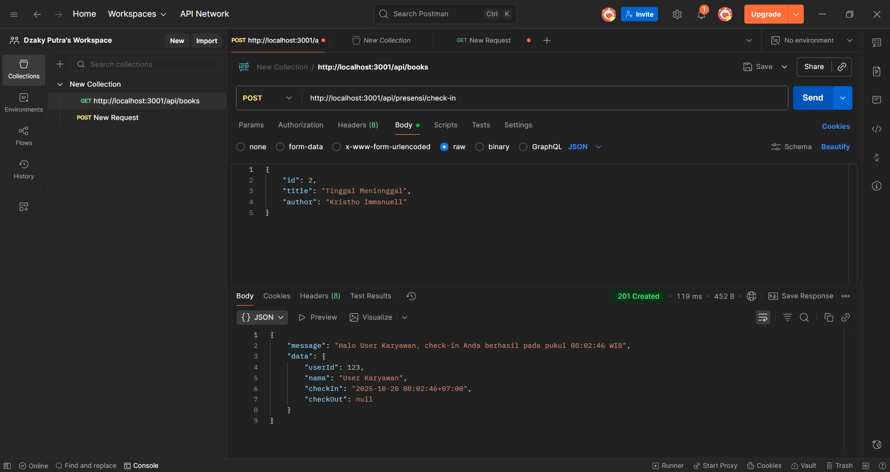
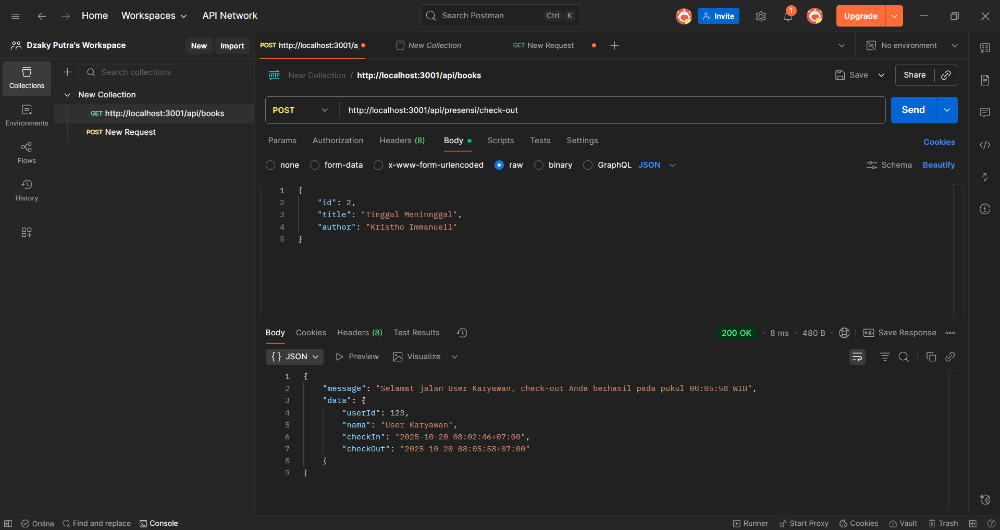
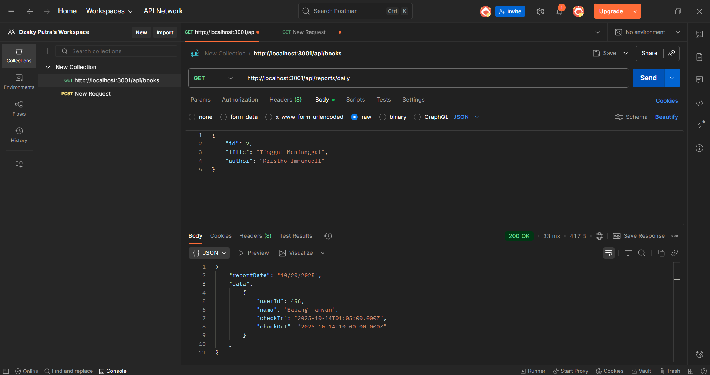

# Tugas 3 - Testing Endpoint Presensi API

## 1. Endpoint `/presensi/check-in`

## 2. Endpoint `/presensi/check-in` (kedua kali)

## 3. Endpoint `/presensi/check-out`

## 4. Endpoint `/presensi/check-out` (tanpa check-in)

## 5. Endpoint `/reports/daily`

